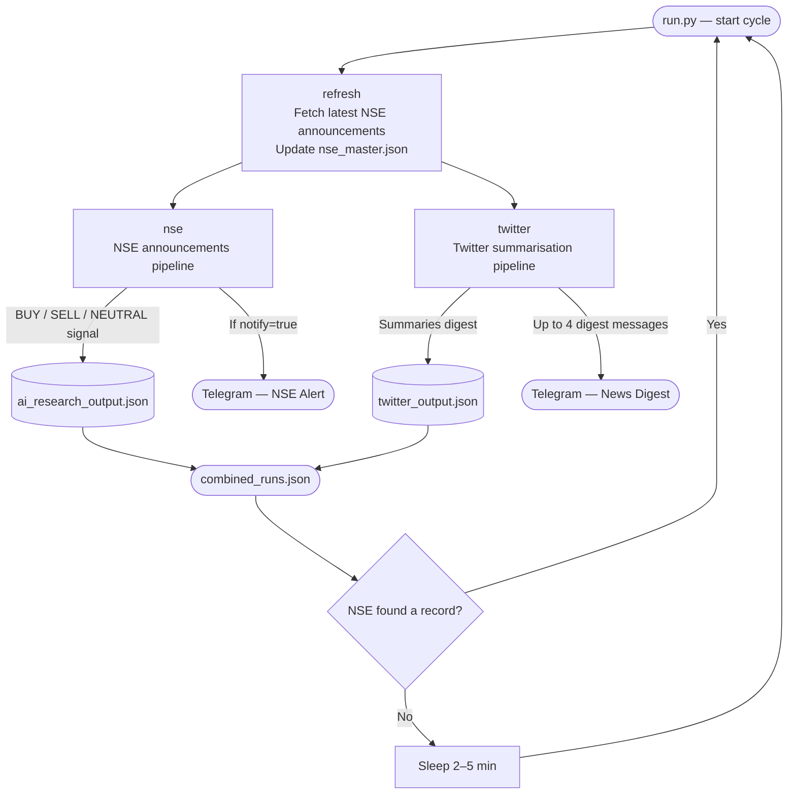
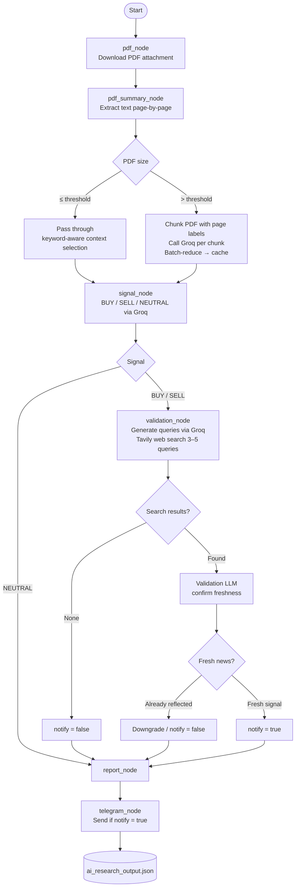
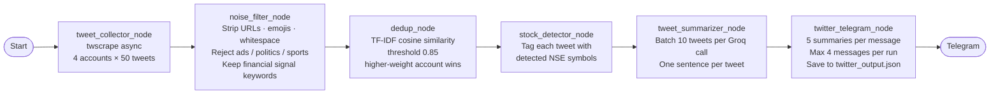

# AI-Driven Indian Stock Market Agent

Two parallel data-ingestion pipelines run simultaneously inside a single LangGraph, both delivering to the same Telegram channel.

| Pipeline | Data source | Telegram output |
|----------|-------------|-----------------|
| **NSE Announcements** | NSE corporate announcements API + PDF attachments | BUY / SELL / NEUTRAL trading signal with full reasoning |
| **Twitter / X News** | CNBCTV18News · NDTVProfitIndia · ETNOWlive · RedboxGlobal | Plain-English news digests — no trading signals |

---

## Quick Start

```bash
# Install dependencies
pip install -r requirements.txt

# Copy and fill in credentials
cp .env.example .env   # or create .env manually (see Environment section)

# Run both pipelines together (recommended)
python run.py

# Single cycle and exit
python run.py --once
```

> Standalone pipeline entry points also work independently:
> ```bash
> python main.py            # NSE pipeline only
> python twitter_main.py    # Twitter pipeline only
> ```

---

## Combined Graph Architecture



Both `nse` and `twitter` nodes execute **in parallel** — LangGraph threads them simultaneously after `refresh` completes. Each pipeline sends to Telegram independently; neither waits for the other.

---

## Pipeline 1 — NSE Announcements Agent

Processes one NSE corporate announcement per cycle, downloads its PDF disclosure, generates a Groq-backed trading signal, optionally validates with Tavily web search, and sends a Telegram alert for fresh actionable signals.

### LangGraph



### Signal decision logic

- **BUY / SELL** — proceeds to Tavily validation. If no search results are found, or the LLM determines the event was already public (`already_reflected = true`), `notify` is set to `false` and no Telegram alert is sent.
- **NEUTRAL** — skips Tavily entirely; no Telegram alert.
- Telegram is only triggered when: signal is BUY or SELL **and** `notify = true`.

### Groq model fallback

Every `call_llm` call attempts models in order — if the primary returns an HTTP error or empty response the next is tried automatically:

```
GROQ_MODEL  →  GROQ_BACKUP_MODEL_1  →  GROQ_BACKUP_MODEL_2  →  raise RuntimeError
```

### Large PDF handling

| PDF size | Behaviour |
|----------|-----------|
| ≤ `PDF_SUMMARY_THRESHOLD_CHARS` | Passed directly to the signal prompt via keyword-aware compact context (head + tail + event-relevant snippets) |
| > `PDF_SUMMARY_THRESHOLD_CHARS` | Split into `PDF_SUMMARY_CHUNK_CHARS` chunks, each labelled `[PAGE N]`. Each chunk summarised by Groq independently. Chunk summaries batch-reduced until ≤ `PDF_SUMMARY_MAX_CHARS`. Result SHA-256 cached in `data/pdf_summaries.json`. |

Scanned / image pages (< 30 characters) are detected and skipped. `PDF_MAX_PAGES` caps extraction on very large documents.

---

## Pipeline 2 — Twitter News Summarisation Agent

Scrapes tweets from four high-credibility Indian financial accounts, filters noise, deduplicates, tags detected stocks, summarises each update in one sentence via Groq, and sends digest messages to Telegram.

**No trading signals are generated from Twitter data.**

### LangGraph



### Deduplication logic

When two tweets exceed 0.85 cosine similarity (TF-IDF vectors), only the one from the higher-weight account is kept. This prevents the same story appearing once per source.

### Target accounts

| Account | Scrape weight |
|---------|--------------|
| CNBCTV18News | 0.90 |
| ETNOWlive | 0.85 |
| NDTVProfitIndia | 0.80 |
| RedboxGlobal | 0.75 |

### Telegram digest format

```
📰 Market Updates  |  03 May 2026 09:15 UTC  |  run a3f8b1c2

• [CNBCTV18News]  RELIANCE
  Reliance Industries announces ₹5,000 crore green energy capex for FY2027.

• [ETNOWlive]  TCS, INFY
  TCS and Infosys Q4 results beat estimates; combined net profit up 9% YoY.

• [NDTVProfitIndia]  SBIN
  SBI reports record quarterly net profit of ₹18,400 crore for Q4 FY2026.
```

---

## Data Files

All outputs are written to `data/` and kept newest-first. Each file is capped to prevent unbounded growth.

### `data/nse_master.json`
Raw NSE corporate announcements fetched from the NSE API. Refreshed at the start of every combined cycle.
```json
[
  {
    "SYMBOL": "RELIANCE",
    "COMPANY NAME": "Reliance Industries Limited",
    "SUBJECT": "Acquisition",
    "DETAILS": "...",
    "BROADCAST DATE/TIME": "2026-05-03T09:00:00",
    "ATTACHMENT": "https://nsearchives.nseindia.com/..."
  }
]
```

### `data/seen_ids.json`
Set of NSE announcement IDs already ingested — prevents re-processing the same disclosure.

### `data/pdf_summaries.json`
SHA-256 keyed cache of large-PDF chunk summaries. Re-processing the same PDF file skips Groq calls entirely.

### `data/ai_research_output.json`
Full LangGraph result for every processed NSE announcement. Newest entry first, unbounded.
```json
[
  {
    "symbol": "RELIANCE",
    "signal": "BUY",
    "confidence": "High",
    "analysis": "...",
    "report": "...",
    "notify": true,
    "telegram_sent": true,
    "status": "SUCCESS"
  }
]
```

### `data/twitter_output.json`
One entry per Twitter pipeline run. Newest first, capped at 500 runs. Written by `twitter_telegram_node` — captured for both standalone and combined runs.
```json
[
  {
    "run_id": "a3f8b1c2",
    "timestamp": "2026-05-03T09:15:42+00:00",
    "pipeline_stats": {
      "raw_tweets": 200,
      "filtered_tweets": 45,
      "deduplicated_tweets": 38,
      "summaries": 12,
      "alerts_sent": 3
    },
    "summaries": [
      {
        "author": "CNBCTV18News",
        "stock_tags": ["RELIANCE"],
        "summary": "Reliance announces ₹5,000 crore green energy capex.",
        "timestamp": "2026-05-03T09:10:00+00:00",
        "tweet_id": "1234567890"
      }
    ],
    "telegram_errors": []
  }
]
```

### `data/combined_runs.json`
One entry per combined `run.py` cycle. Newest first, capped at 500 runs. Written by `run.py` after every cycle regardless of outcome.
```json
[
  {
    "run_id": "a3f8b1c2",
    "timestamp": "2026-05-03T09:15:42",
    "nse": {
      "status": "SUCCESS",
      "symbol": "RELIANCE",
      "signal": "BUY",
      "telegram_sent": true,
      "error": ""
    },
    "twitter": {
      "status": "SUCCESS",
      "summaries_count": 12,
      "alerts_sent": 3,
      "error": ""
    }
  }
]
```

### `data/twscrape.db`
SQLite session store created by `twscrape` on first run. Persists authenticated Twitter sessions so re-login is not needed on subsequent runs.

---

## Environment Variables

Create `.env` in the project root:

```env
# ── Groq LLM (both pipelines) ────────────────────────────────────────────────
GROQ_API_KEY=
GROQ_MODEL=openai/gpt-oss-120b
GROQ_BACKUP_MODEL_1=llama-3.3-70b-versatile
GROQ_BACKUP_MODEL_2=llama3-70b-8192
GROQ_TIMEOUT_SECONDS=90
GROQ_QUERY_TIMEOUT_SECONDS=90
GROQ_VALIDATION_TIMEOUT_SECONDS=120

# ── Telegram (both pipelines) ─────────────────────────────────────────────────
TELEGRAM_BOT_TOKEN=
TELEGRAM_CHAT_ID=

# ── NSE pipeline ──────────────────────────────────────────────────────────────
TAVILY_API_KEY=

PDF_MAX_PAGES=200
SIGNAL_PDF_MAX_CHARS=18000
PDF_SUMMARY_THRESHOLD_CHARS=18000
PDF_SUMMARY_CHUNK_CHARS=12000
PDF_SUMMARY_MAX_CHARS=5000
PDF_SUMMARY_TIMEOUT_SECONDS=180
PDF_SUMMARY_NUM_PREDICT=384
PDF_SUMMARY_FINAL_NUM_PREDICT=700
PDF_SUMMARY_BATCH_SIZE=6

# ── Twitter pipeline ──────────────────────────────────────────────────────────
# One or more Twitter/X accounts for twscrape to authenticate with.
# Format: username,password,email,email_password
# Multiple accounts separated by semicolons:
TWITTER_ACCOUNTS=user1,pass1,email1,epass1;user2,pass2,email2,epass2
TWEETS_PER_ACCOUNT=50
```

---

## Project Structure

```
ai_research_agent/
│
│  ── Entry points ──────────────────────────────────────────────────────
├── run.py                           # ★ PRIMARY — both pipelines in parallel
├── main.py                          # NSE pipeline standalone
├── twitter_main.py                  # Twitter pipeline standalone
│
│  ── Combined graph ────────────────────────────────────────────────────
├── combined_graph.py                # refresh → [nse ‖ twitter] → END
├── combined_state.py                # CombinedState TypedDict
│
│  ── NSE pipeline ───────────────────────────────────────────────────────
├── graph.py                         # NSE LangGraph (6 nodes)
├── state.py                         # GraphState TypedDict
├── nse_fetcher.py                   # NSE API fetcher + nse_master.json writer
│
│  ── Twitter pipeline ──────────────────────────────────────────────────
├── twitter_graph.py                 # Twitter LangGraph (6 nodes)
├── twitter_state.py                 # TwitterState TypedDict
│
├── nodes/
│   │  NSE nodes
│   ├── pdf_node.py                  # Download PDF attachment
│   ├── pdf_summary_node.py          # Chunk-summarise large PDFs; cache results
│   ├── signal_node.py               # Generate BUY / SELL / NEUTRAL via Groq
│   ├── validation_node.py           # Validate signal with Tavily web search
│   ├── report_node.py               # Format final report string
│   ├── telegram_node.py             # Send Telegram alert when notify=true
│   │
│   │  Twitter nodes
│   ├── tweet_collector_node.py      # Fetch tweets via twscrape
│   ├── noise_filter_node.py         # Clean text; keep only financial keywords
│   ├── dedup_node.py                # TF-IDF cosine deduplication
│   ├── stock_detector_node.py       # Tag tweets with NSE symbols
│   ├── tweet_summarizer_node.py     # Batch Groq summarisation (10 tweets/call)
│   └── twitter_telegram_node.py     # Send digests; write twitter_output.json
│
├── services/
│   ├── llm_service.py               # Groq API — primary + 2 backup models
│   ├── telegram_service.py          # Telegram Bot API
│   ├── pdf_service.py               # PDF download + page-by-page extraction
│   ├── tavily_service.py            # Tavily web search
│   ├── twitter_scraper_service.py   # twscrape async wrapper
│   ├── stock_detector_service.py    # NSE symbol lookup + 50+ company aliases
│   └── dedup_service.py             # Pure-Python TF-IDF cosine similarity
│
├── utils/
│   ├── logger.py                    # log(stage, message) helper
│   └── retry.py                     # Retry decorator
│
└── data/                            # All outputs — never committed to git
    ├── nse_master.json              # NSE announcements cache (auto-refreshed)
    ├── seen_ids.json                # Processed NSE record IDs
    ├── pdf_summaries.json           # SHA-256 keyed PDF summary cache
    ├── ai_research_output.json      # NSE signal results (full state per stock)
    ├── twitter_output.json          # Twitter summaries per run (capped 500)
    ├── combined_runs.json           # Combined cycle log (capped 500)
    └── twscrape.db                  # Twitter session store (SQLite)
```

---

## Dependencies

```
langchain
langgraph
requests
python-dotenv
pymupdf
pandas
twscrape
```

Install: `pip install -r requirements.txt`
