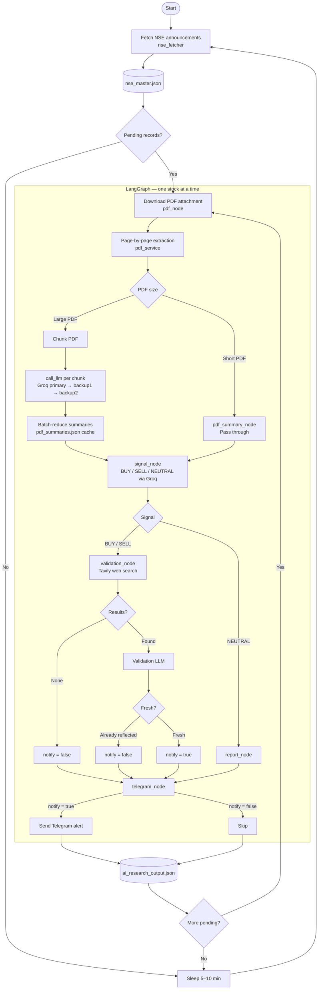
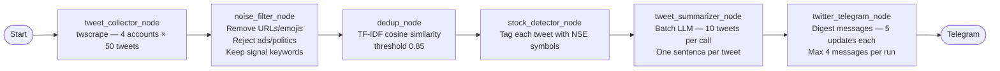

# AI-Driven Indian Stock Market Agent

Two parallel data-ingestion pipelines feed different information streams into the same Telegram delivery channel:

| Pipeline | Entry point | Data source | Output |
|----------|-------------|-------------|--------|
| **NSE Announcements** | `main.py` | NSE corporate announcements API + PDF attachments | BUY / SELL / NEUTRAL trading signals |
| **Twitter News** | `twitter_main.py` | X/Twitter accounts (CNBCTV18News, NDTVProfitIndia, ETNOWlive, RedboxGlobal) | Plain-English news summaries |

Both pipelines are independent — they share only `services/llm_service.py` and `services/telegram_service.py`.

---

## Pipeline 1 — NSE Announcements Agent

### Workflow



### Run

```bash
python main.py          # continuous loop
python main.py --once   # single record then exit
```

### Key files

| File | Role |
|------|------|
| [main.py](main.py) | Run loop, dedup processed records, writes `data/ai_research_output.json` |
| [nse_fetcher.py](nse_fetcher.py) | Fetches NSE API, normalises fields, maintains `data/nse_master.json` |
| [graph.py](graph.py) | LangGraph wiring |
| [state.py](state.py) | `GraphState` TypedDict |
| [nodes/pdf_node.py](nodes/pdf_node.py) | Downloads PDF attachment |
| [nodes/pdf_summary_node.py](nodes/pdf_summary_node.py) | Chunk-summarises large PDFs, caches in `data/pdf_summaries.json` |
| [nodes/signal_node.py](nodes/signal_node.py) | Generates BUY / SELL / NEUTRAL via Groq |
| [nodes/validation_node.py](nodes/validation_node.py) | Validates actionable signals with Tavily |
| [nodes/report_node.py](nodes/report_node.py) | Formats final report |
| [nodes/telegram_node.py](nodes/telegram_node.py) | Sends Telegram alert when `notify=true` |

---

## Pipeline 2 — Twitter News Summarisation Agent

### Workflow



**No trading signals are generated from Twitter.** The pipeline summarises news updates and delivers them as readable digests.

### Telegram digest format

```
📰 Market Updates  |  02 May 2026 09:15 UTC  |  run a3f8b1c2

• [CNBCTV18News]  RELIANCE
  Reliance Industries announces ₹5,000 crore green energy capex for FY2027.

• [ETNOWlive]  TCS, INFY
  TCS and Infosys Q4 results beat street estimates; combined net profit up 9% YoY.

• [NDTVProfitIndia]  SBIN
  SBI reports record net profit of ₹18,400 crore for Q4 FY2026.
```

### Run

```bash
python twitter_main.py          # continuous loop (2–5 min interval)
python twitter_main.py --once   # single cycle then exit
```

### Key files

| File | Role |
|------|------|
| [twitter_main.py](twitter_main.py) | Run loop, prints per-run summary |
| [twitter_graph.py](twitter_graph.py) | LangGraph wiring for 6 nodes |
| [twitter_state.py](twitter_state.py) | `TwitterState` TypedDict |
| [nodes/tweet_collector_node.py](nodes/tweet_collector_node.py) | Calls `twitter_scraper_service.fetch_tweets()` |
| [nodes/noise_filter_node.py](nodes/noise_filter_node.py) | Cleans text, applies keyword + reject-pattern filters |
| [nodes/dedup_node.py](nodes/dedup_node.py) | Pure-Python TF-IDF deduplication |
| [nodes/stock_detector_node.py](nodes/stock_detector_node.py) | Tags tweets with detected NSE symbols |
| [nodes/tweet_summarizer_node.py](nodes/tweet_summarizer_node.py) | Batched Groq summarisation (10 tweets/call) |
| [nodes/twitter_telegram_node.py](nodes/twitter_telegram_node.py) | Sends digest messages (5 updates/message, max 4/run) |
| [services/twitter_scraper_service.py](services/twitter_scraper_service.py) | `twscrape` async wrapper, stores session in `data/twscrape.db` |
| [services/stock_detector_service.py](services/stock_detector_service.py) | NSE master lookup + 50+ hardcoded company-name aliases |
| [services/dedup_service.py](services/dedup_service.py) | TF-IDF cosine similarity (no external deps) |

### Target accounts and weights

| Account | Weight |
|---------|--------|
| CNBCTV18News | 0.90 |
| ETNOWlive | 0.85 |
| NDTVProfitIndia | 0.80 |
| RedboxGlobal | 0.75 |

Account weights are metadata only in this pipeline (used for dedup tie-breaking — higher-weight tweet survives when two are near-duplicate).

---

## Shared Services

| Service | Used by |
|---------|---------|
| [services/llm_service.py](services/llm_service.py) | Both pipelines — Groq with primary + two backup model fallback |
| [services/telegram_service.py](services/telegram_service.py) | Both pipelines — Telegram Bot API sender |
| [services/pdf_service.py](services/pdf_service.py) | NSE pipeline only |
| [services/tavily_service.py](services/tavily_service.py) | NSE pipeline only |

---

## Environment Variables

Create a `.env` file in the project root:

```env
# ── Groq LLM ────────────────────────────────────────────────────────────────
GROQ_API_KEY=
GROQ_MODEL=openai/gpt-oss-120b
GROQ_BACKUP_MODEL_1=llama-3.3-70b-versatile
GROQ_BACKUP_MODEL_2=llama3-70b-8192
GROQ_TIMEOUT_SECONDS=90
GROQ_QUERY_TIMEOUT_SECONDS=90
GROQ_VALIDATION_TIMEOUT_SECONDS=120

# ── Telegram ─────────────────────────────────────────────────────────────────
TELEGRAM_BOT_TOKEN=
TELEGRAM_CHAT_ID=

# ── NSE pipeline ─────────────────────────────────────────────────────────────
TAVILY_API_KEY=
PDF_MAX_PAGES=200
SIGNAL_PDF_MAX_CHARS=18000
PDF_SUMMARY_THRESHOLD_CHARS=18000
PDF_SUMMARY_CHUNK_CHARS=12000
PDF_SUMMARY_MAX_CHARS=5000
PDF_SUMMARY_TIMEOUT_SECONDS=180
PDF_SUMMARY_NUM_PREDICT=384
PDF_SUMMARY_FINAL_NUM_PREDICT=700
PDF_SUMMARY_BATCH_SIZE=6

# ── Twitter pipeline ──────────────────────────────────────────────────────────
# Semicolon-separated list of Twitter accounts to scrape with
# Format: username,password,email,email_password
TWITTER_ACCOUNTS=user1,pass1,email1,epass1;user2,pass2,email2,epass2
TWEETS_PER_ACCOUNT=50
```

> **twscrape note:** `twscrape` requires one or more real Twitter/X accounts to authenticate.  
> After first run the session is cached at `data/twscrape.db` — no re-login needed on subsequent runs.

---

## Project Structure

```
ai_research_agent/
├── main.py                          # NSE pipeline entry point
├── twitter_main.py                  # Twitter pipeline entry point
├── graph.py                         # NSE LangGraph
├── twitter_graph.py                 # Twitter LangGraph
├── state.py                         # NSE state
├── twitter_state.py                 # Twitter state
├── nse_fetcher.py                   # NSE API fetcher
│
├── nodes/
│   ├── pdf_node.py                  # NSE: download PDF
│   ├── pdf_summary_node.py          # NSE: chunk-summarise large PDFs
│   ├── signal_node.py               # NSE: BUY/SELL/NEUTRAL signal
│   ├── validation_node.py           # NSE: Tavily validation
│   ├── report_node.py               # NSE: format report
│   ├── telegram_node.py             # NSE: Telegram alert
│   ├── tweet_collector_node.py      # Twitter: fetch tweets
│   ├── noise_filter_node.py         # Twitter: clean + filter
│   ├── dedup_node.py                # Twitter: deduplication
│   ├── stock_detector_node.py       # Twitter: tag with NSE symbols
│   ├── tweet_summarizer_node.py     # Twitter: LLM summarisation
│   └── twitter_telegram_node.py    # Twitter: digest to Telegram
│
├── services/
│   ├── llm_service.py               # Groq API (shared)
│   ├── telegram_service.py          # Telegram Bot API (shared)
│   ├── pdf_service.py               # PDF download + extraction (NSE)
│   ├── tavily_service.py            # Tavily web search (NSE)
│   ├── twitter_scraper_service.py   # twscrape wrapper (Twitter)
│   ├── stock_detector_service.py    # NSE symbol lookup (Twitter)
│   └── dedup_service.py             # TF-IDF cosine dedup (Twitter)
│
├── utils/
│   ├── logger.py
│   └── retry.py
│
└── data/
    ├── nse_master.json              # NSE announcements cache
    ├── ai_research_output.json      # NSE signal results
    ├── pdf_summaries.json           # PDF summary cache
    ├── seen_ids.json                # Processed NSE record IDs
    └── twscrape.db                  # Twitter session store
```

---

## Large PDF Handling (NSE Pipeline)

**Short PDFs** (`≤ PDF_SUMMARY_THRESHOLD_CHARS`): passed directly into the signal prompt via keyword-aware compact context selection. Head, tail, and event-relevant snippets are preserved within `SIGNAL_PDF_MAX_CHARS`.

**Large PDFs** (`> PDF_SUMMARY_THRESHOLD_CHARS`): split into `PDF_SUMMARY_CHUNK_CHARS` chunks each labelled with PDF page range. Each chunk is summarised by Groq independently. Chunk summaries are batch-reduced until one combined summary fits within `PDF_SUMMARY_MAX_CHARS`. Results are SHA-256 cached in `data/pdf_summaries.json`.

**Extraction**: text is read page-by-page with `[PAGE N]` markers. Pages with fewer than 30 characters (scanned/image) are skipped. `PDF_MAX_PAGES` caps extraction on very large documents.

---

## Groq Model Fallback (Both Pipelines)

Every `call_llm` call attempts models in order:

```
Primary (GROQ_MODEL)  →  Backup 1  →  Backup 2  →  raise RuntimeError
```

All three models are configurable via environment variables.

---


