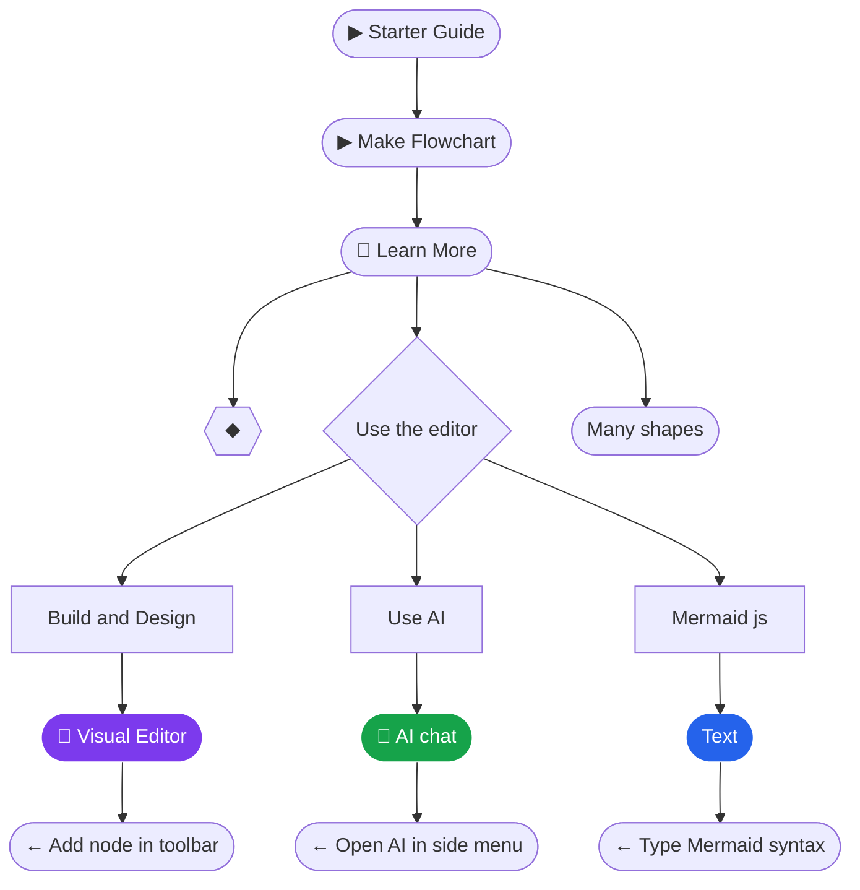
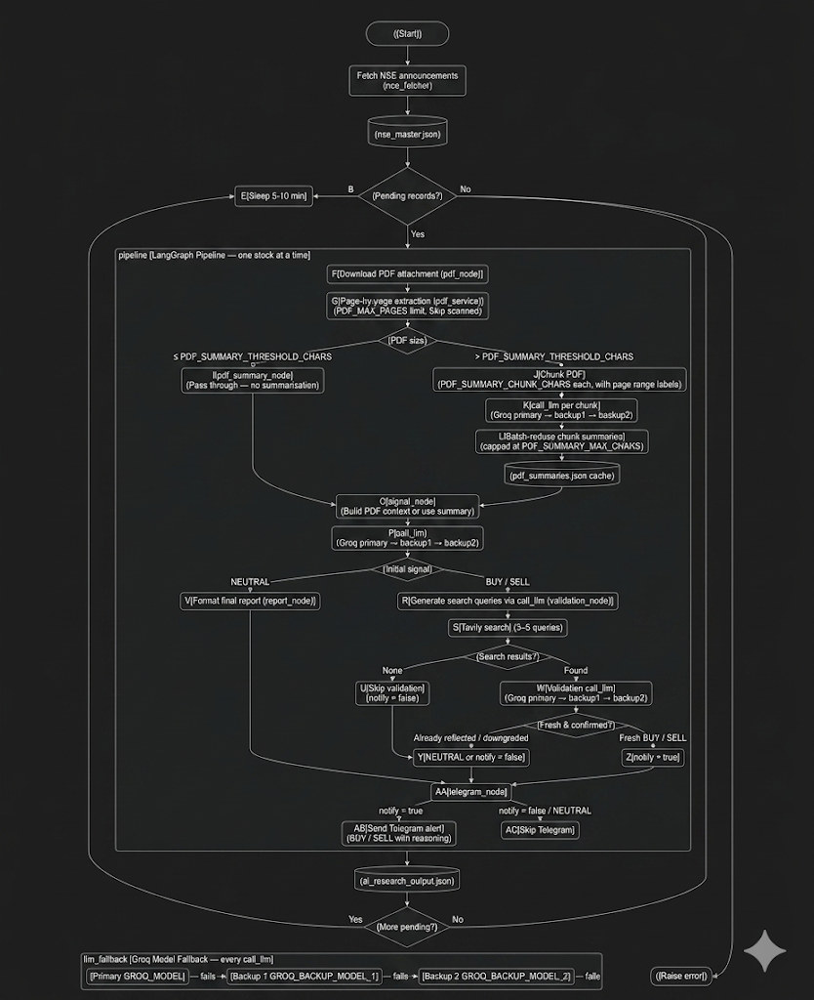

# AI-Driven NSE Stock Research Agent

This project analyzes NSE corporate announcements, extracts disclosure PDFs, generates Groq-backed trading signals, conditionally validates actionable signals with Tavily, and sends Telegram alerts.

## Complete Workflow



## Project Structure

- [main.py](main.py) — orchestrates the end-to-end run loop; writes `data/ai_research_output.json`
- [nse_fetcher.py](nse_fetcher.py) — fetches NSE announcements, normalizes fields, fixes attachment URLs, maintains `data/nse_master.json`
- [graph.py](graph.py) — builds the LangGraph workflow
- [state.py](state.py) — defines the shared graph state
- [nodes/](nodes/) — one file per pipeline step
  - [nodes/pdf_node.py](nodes/pdf_node.py) — downloads the PDF attachment
  - [nodes/pdf_summary_node.py](nodes/pdf_summary_node.py) — chunk-summarizes large PDFs via Groq, caches results
  - [nodes/signal_node.py](nodes/signal_node.py) — generates initial BUY/SELL/NEUTRAL signal
  - [nodes/validation_node.py](nodes/validation_node.py) — validates BUY/SELL signals with Tavily search
  - [nodes/report_node.py](nodes/report_node.py) — formats the final report
  - [nodes/telegram_node.py](nodes/telegram_node.py) — sends Telegram alerts for fresh actionable signals
- [services/](services/) — thin wrappers around external APIs
  - [services/llm_service.py](services/llm_service.py) — Groq API with primary + two backup model fallback
  - [services/pdf_service.py](services/pdf_service.py) — PDF download and page-by-page text extraction
  - [services/tavily_service.py](services/tavily_service.py) — Tavily web search
  - [services/telegram_service.py](services/telegram_service.py) — Telegram bot message sender
- [utils/](utils/) — logger and retry helpers

## Environment

Create a local `.env` file:

```env
# Groq — primary and two backup models
GROQ_API_KEY=
GROQ_MODEL=openai/gpt-oss-120b
GROQ_BACKUP_MODEL_1=llama-3.3-70b-versatile
GROQ_BACKUP_MODEL_2=llama3-70b-8192
GROQ_TIMEOUT_SECONDS=90
GROQ_QUERY_TIMEOUT_SECONDS=90
GROQ_VALIDATION_TIMEOUT_SECONDS=120

# PDF extraction
PDF_MAX_PAGES=200

# Large-PDF summarization
SIGNAL_PDF_MAX_CHARS=18000
PDF_SUMMARY_THRESHOLD_CHARS=18000
PDF_SUMMARY_CHUNK_CHARS=12000
PDF_SUMMARY_MAX_CHARS=5000
PDF_SUMMARY_TIMEOUT_SECONDS=180
PDF_SUMMARY_NUM_PREDICT=384
PDF_SUMMARY_FINAL_NUM_PREDICT=700
PDF_SUMMARY_BATCH_SIZE=6

# External APIs
TAVILY_API_KEY=
TELEGRAM_BOT_TOKEN=
TELEGRAM_CHAT_ID=
```

## Large PDF Handling

NSE attachments range from short one-page filings to multi-hundred-page annual reports and prospectuses. The pipeline handles them in two tiers:

**Short PDFs** (`≤ PDF_SUMMARY_THRESHOLD_CHARS`): passed directly into the signal prompt via keyword-aware compact context selection (`build_pdf_context` in `signal_node`). Head, tail, and event-relevant snippets are preserved within `SIGNAL_PDF_MAX_CHARS`.

**Large PDFs** (`> PDF_SUMMARY_THRESHOLD_CHARS`): the `pdf_summary_node` splits the text into `PDF_SUMMARY_CHUNK_CHARS` chunks, each labelled with its PDF page range (e.g. `PDF CHUNK 2 OF 8 (pages 13-24)`). Each chunk is summarized by Groq independently. If there are more than `PDF_SUMMARY_BATCH_SIZE` chunk summaries, they are reduced in batch rounds until a single combined summary fits within `PDF_SUMMARY_MAX_CHARS`. The final summary is cached in `data/pdf_summaries.json` by SHA-256 of the raw text, so re-processing the same PDF skips summarization entirely.

**Extraction** (`pdf_service`): text is read page-by-page with `[PAGE N]` markers. Pages with fewer than 30 characters are detected as scanned/image pages and skipped. `PDF_MAX_PAGES` (default 200) caps extraction on very large documents. A header note is prepended when pages are truncated or scanned pages are skipped.

## Groq Model Fallback

Every `call_llm` call tries models in order: primary → backup 1 → backup 2. If the primary model returns an HTTP error or an empty response, the next model is tried automatically and a `[LLM]` warning is printed. All three models are configurable via environment variables.

## Signal Decision Logic

- **BUY / SELL** signals proceed to Tavily validation. If external search returns no results, or the LLM determines the event was already public and reflected in the stock price (`already_reflected=true`), the signal is either downgraded to NEUTRAL or `notify` is set to `false`. Telegram alerts are only sent when both conditions hold: signal is BUY or SELL **and** `notify=true`.
- **NEUTRAL** signals skip Tavily search and Telegram entirely.

## Run

```bash
python main.py
```

By default, the agent runs continuously — one stock at a time, no delay between pending stocks, and a random 5–10 minute sleep when the local queue is empty before re-fetching NSE.

```bash
python main.py --once   # process one record then exit
```

Press `Ctrl+C` to stop the loop.





    
