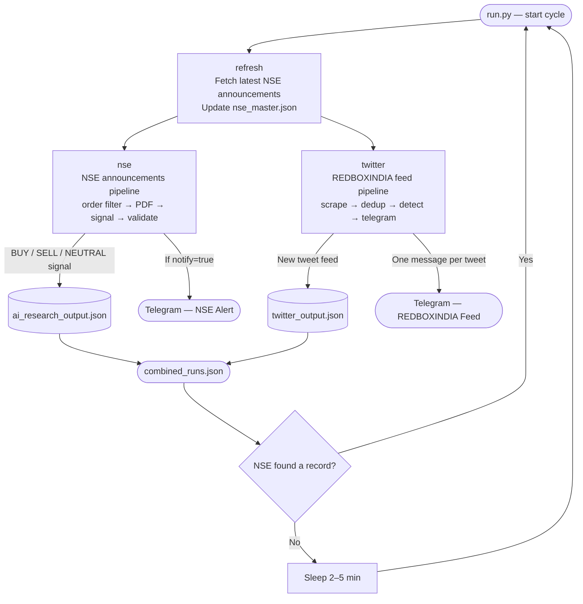
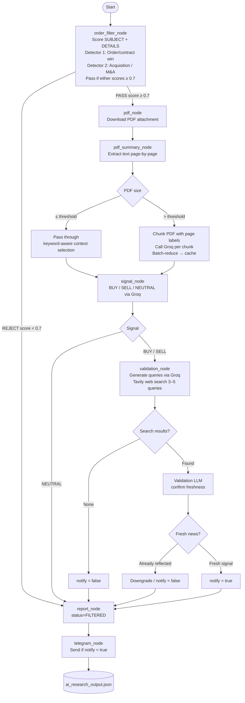
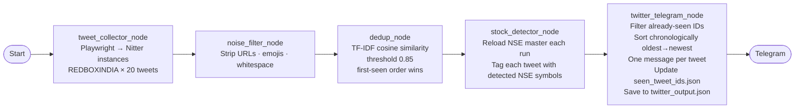

# AI-Driven Indian Stock Market Agent

Two parallel data-ingestion pipelines run simultaneously inside a single LangGraph, both delivering to the same Telegram channel.

| Pipeline | Data source | Telegram output |
|----------|-------------|-----------------|
| **NSE Announcements** | NSE corporate announcements API + PDF attachments | BUY / SELL / NEUTRAL trading signal with full reasoning |
| **REDBOXINDIA Feed** | REDBOXINDIA on X (via Playwright + Nitter) | Each tweet sent individually, in chronological order |

---

## Quick Start

```bash
# Install dependencies
pip install -r requirements.txt
playwright install chromium

# Copy and fill in credentials
cp .env.example .env   # or create .env manually (see Environment section)

# Run both pipelines together (recommended)
python run.py

# Single cycle and exit
python run.py --once
```

> Standalone pipeline entry points also work independently:
> ```bash
> python main.py            # NSE pipeline only
> python twitter_main.py    # Twitter pipeline only
> ```

---

## Combined Graph Architecture



Both `nse` and `twitter` nodes execute **in parallel** — LangGraph threads them simultaneously after `refresh` completes. Each pipeline sends to Telegram independently; neither waits for the other.

---

## Pipeline 1 — NSE Announcements Agent

Processes one NSE corporate announcement per cycle. A rule-based pre-filter runs first — only **revenue-generating order/contract wins and acquisition/M&A events** proceed to the full LLM pipeline. Legal/regulatory noise is discarded without spending any Groq or Tavily credits.

### LangGraph



### Pre-filter — scoring engine

The filter runs on `SUBJECT + DETAILS` text before any API call is made. Two detectors run in parallel — a record passes if **either** scores ≥ 0.7; the higher-scoring result is used.

#### Detector 1 — Order / contract win

| Signal | Keywords / patterns | Weight |
|--------|---------------------|--------|
| Primary | "secured order", "bagged contract", "letter of award", "epc order", regex patterns | +0.5 |
| Business context | project, supply, execution, client, solar, power, railway… | +0.2 |
| Monetary value | crore, million, lakh, worth, ₹… | +0.2 |
| No negative keywords | — | +0.1 |

**Hard reject** on any order-negative keyword: `order-in-appeal`, `court order`, `gst order`, `penalty order`, `show cause`, `stay order`, `injunction`, etc.

#### Detector 2 — Acquisition / M&A

| Signal | Keywords / patterns | Weight |
|--------|---------------------|--------|
| Primary | acquisition, acquire, buyout, takeover, merger, amalgamation, stake acquisition, equity stake… | +0.6 |
| Supporting context | subsidiary, target company, deal value, board approval, definitive agreement… | +0.3 |
| No negative keywords | — | +0.1 |

**Hard reject** on acquisition-negative keywords: `denies`, `rumor`, `no acquisition`, `withdrawn`, `clarification`, `media report`.

#### Merge logic

```
order_result  = _score_order(text)     # max 1.0
acq_result    = _score_acquisition(text)  # max 1.0

passing = [r for r in (order_result, acq_result) if r.score >= 0.7]
winner  = max(passing, key=score)  # highest score wins
status  = PASS if passing else REJECT
```

`event_type` in the output is `"order_win"` or `"acquisition"` depending on which detector passed.

**Pass threshold**: score ≥ 0.7 → full pipeline. Below threshold → `status = FILTERED`, no Groq/Tavily calls, no Telegram.

### Signal decision logic

- **FILTERED** — rejected by order filter; skips PDF download and all LLM calls; not sent to Telegram.
- **BUY / SELL** — proceeds to Tavily validation. If no search results are found, or the LLM determines the event was already public (`already_reflected = true`), `notify` is set to `false` and no Telegram alert is sent.
- **NEUTRAL** — skips Tavily entirely; no Telegram alert.
- Telegram is only triggered when: signal is BUY or SELL **and** `notify = true`.

### Groq model fallback

Every `call_llm` call attempts models in order — if the primary returns an HTTP error or empty response the next is tried automatically:

```
GROQ_MODEL  →  GROQ_BACKUP_MODEL_1  →  GROQ_BACKUP_MODEL_2  →  raise RuntimeError
```

### Large PDF handling

| PDF size | Behaviour |
|----------|-----------|
| ≤ `PDF_SUMMARY_THRESHOLD_CHARS` | Passed directly to the signal prompt via keyword-aware compact context (head + tail + event-relevant snippets) |
| > `PDF_SUMMARY_THRESHOLD_CHARS` | Split into `PDF_SUMMARY_CHUNK_CHARS` chunks, each labelled `[PAGE N]`. Each chunk summarised by Groq independently. Chunk summaries batch-reduced until ≤ `PDF_SUMMARY_MAX_CHARS`. Result SHA-256 cached in `data/pdf_summaries.json`. |

Scanned / image pages (< 30 characters) are detected and skipped. `PDF_MAX_PAGES` caps extraction on very large documents.

---

## Pipeline 2 — REDBOXINDIA Feed Agent

Scrapes tweets from **REDBOXINDIA** using Playwright, deduplicates within and across runs, tags detected NSE stocks, and sends each new tweet as an individual Telegram message in chronological order.

**No LLM summarisation. No filtering. Every tweet goes directly to Telegram.**

### LangGraph



### Scraping strategy

Tweets are fetched via **Playwright + Nitter** (no X account or API key required):

1. Playwright launches a headless Chromium browser
2. Navigates to each Nitter instance (tried in order until one responds)
3. Parses `.timeline-item` elements for tweet text and timestamp
4. Falls back to `x.com` directly only if all Nitter instances fail

Nitter instances tried (in order):

```
nitter.tiekoetter.com → nitter.poast.org → nitter.1d4.us →
nitter.kavin.rocks → nitter.cz → nitter.it → x.com (last resort)
```

### Deduplication — two layers

| Layer | Scope | Method |
|-------|-------|--------|
| Within-run | Same pipeline cycle | TF-IDF cosine similarity ≥ 0.85; first-seen order wins |
| Cross-run | Across all previous runs | Content-stable `tweet_id` (MD5 of normalised text + author) checked against `data/seen_tweet_ids.json` |

`tweet_id` is derived from normalised tweet content — not timestamps — so it stays stable even if Playwright renders the page slightly differently each run. IDs are recorded only after a Telegram message sends successfully.

### Telegram message format

Each tweet is sent as a **separate Telegram message**, in chronological order (oldest first).

```
🔴 REDBOXINDIA

POWER TARIFFS LIKELY TO RISE AS REGULATORS ACT ON SC ORDER - FE

🕐 11:13 UTC  ·  04 May 2026
```

---

## Data Files

All outputs are written to `data/` and kept newest-first. Each file is capped to prevent unbounded growth.

### `data/nse_master.json`
Raw NSE corporate announcements fetched from the NSE API. Refreshed at the start of every combined cycle.

### `data/seen_ids.json`
Set of NSE announcement IDs already ingested — prevents re-processing the same disclosure.

### `data/pdf_summaries.json`
SHA-256 keyed cache of large-PDF chunk summaries. Re-processing the same PDF file skips Groq calls entirely.

### `data/ai_research_output.json`
Full LangGraph result for every processed NSE announcement. Newest entry first.

### `data/twitter_output.json`
One entry per Twitter pipeline run. Newest first, capped at 500 runs.
```json
[
  {
    "run_id": "a3f8b1c2",
    "timestamp": "2026-05-04T11:13:19+00:00",
    "pipeline_stats": {
      "raw_tweets": 20,
      "filtered_tweets": 20,
      "deduplicated_tweets": 18,
      "new_tweets": 5,
      "alerts_sent": 5
    },
    "tweets": [
      {
        "tweet_id": "3f8b1c2a4d6e",
        "author": "REDBOXINDIA",
        "raw_text": "POWER TARIFFS LIKELY TO RISE AS REGULATORS ACT ON SC ORDER - FE",
        "clean_text": "POWER TARIFFS LIKELY TO RISE AS REGULATORS ACT ON SC ORDER - FE",
        "created_at": "2026-05-04T09:10:00+00:00",
        "stock_tags": ["NTPC", "TATAPOWER"],
        "source": "playwright+nitter:nitter.tiekoetter.com"
      }
    ],
    "fetch_debug": [
      {
        "account": "REDBOXINDIA",
        "status": "SUCCESS",
        "tweets_fetched": 20,
        "error": "",
        "source": "playwright+nitter"
      }
    ],
    "telegram_errors": []
  }
]
```

### `data/seen_tweet_ids.json`
Flat list of tweet IDs (MD5 hashes) already sent to Telegram. Capped at 5,000 entries. Prevents the same tweet being re-sent across multiple runs.

### `data/combined_runs.json`
One entry per combined `run.py` cycle. Newest first, capped at 500 runs.

---

## Environment Variables

Create `.env` in the project root:

```env
# ── Groq LLM (NSE pipeline only) ─────────────────────────────────────────────
GROQ_API_KEY=
GROQ_MODEL=openai/gpt-oss-120b
GROQ_BACKUP_MODEL_1=llama-3.3-70b-versatile
GROQ_BACKUP_MODEL_2=llama3-70b-8192
GROQ_TIMEOUT_SECONDS=90
GROQ_QUERY_TIMEOUT_SECONDS=90
GROQ_VALIDATION_TIMEOUT_SECONDS=120

# ── Telegram (NSE + REDBOXINDIA pipelines) ────────────────────────────────────
TELEGRAM_BOT_TOKEN=
TELEGRAM_CHAT_ID=

# ── NSE pipeline ──────────────────────────────────────────────────────────────
TAVILY_API_KEY=

PDF_MAX_PAGES=200
SIGNAL_PDF_MAX_CHARS=18000
PDF_SUMMARY_THRESHOLD_CHARS=18000
PDF_SUMMARY_CHUNK_CHARS=12000
PDF_SUMMARY_MAX_CHARS=5000
PDF_SUMMARY_TIMEOUT_SECONDS=180
PDF_SUMMARY_NUM_PREDICT=384
PDF_SUMMARY_FINAL_NUM_PREDICT=700
PDF_SUMMARY_BATCH_SIZE=6

# ── REDBOXINDIA pipeline ─────────────────────────────────────────────────────
# Number of tweets to fetch per run (default 20)
TWEETS_PER_ACCOUNT=20
```

> No Twitter/X account or API key is required. Playwright scrapes via public Nitter instances.

---

## Project Structure

```
ai_research_agent/
│
│  ── Entry points ──────────────────────────────────────────────────────
├── run.py                           # ★ PRIMARY — both pipelines in parallel
├── main.py                          # NSE pipeline standalone
├── twitter_main.py                  # REDBOXINDIA pipeline standalone
│
│  ── Combined graph ────────────────────────────────────────────────────
├── combined_graph.py                # refresh → [nse ‖ twitter] → END
├── combined_state.py                # CombinedState TypedDict
│
│  ── NSE pipeline ───────────────────────────────────────────────────────
├── graph.py                         # NSE LangGraph (7 nodes)
├── state.py                         # GraphState TypedDict
├── nse_fetcher.py                   # NSE API fetcher + nse_master.json writer
│
│  ── REDBOXINDIA pipeline ──────────────────────────────────────────────
├── twitter_graph.py                 # REDBOXINDIA LangGraph (5 nodes)
├── twitter_state.py                 # TwitterState TypedDict
│
├── nodes/
│   │  NSE nodes
│   ├── order_filter_node.py         # Score SUBJECT+DETAILS; gate LLM pipeline
│   ├── pdf_node.py                  # Download PDF attachment
│   ├── pdf_summary_node.py          # Chunk-summarise large PDFs; cache results
│   ├── signal_node.py               # Generate BUY / SELL / NEUTRAL via Groq
│   ├── validation_node.py           # Validate signal with Tavily web search
│   ├── report_node.py               # Format final report string
│   ├── telegram_node.py             # Send Telegram alert when notify=true
│   │
│   │  Twitter / REDBOXINDIA nodes
│   ├── tweet_collector_node.py      # Fetch tweets via Playwright+Nitter
│   ├── noise_filter_node.py         # Strip URLs, emojis, whitespace
│   ├── dedup_node.py                # TF-IDF cosine deduplication (within-run)
│   ├── stock_detector_node.py       # Reload NSE master; tag tweets with NSE symbols
│   └── twitter_telegram_node.py     # Filter seen IDs; sort chronologically; send one message per tweet; write output
│
├── services/
│   ├── llm_service.py               # Groq API — primary + 2 backup models
│   ├── telegram_service.py          # Telegram Bot API
│   ├── pdf_service.py               # PDF download + page-by-page extraction
│   ├── tavily_service.py            # Tavily web search
│   ├── order_filter_service.py      # Dual detector: order/contract win + acquisition/M&A scoring
│   ├── twitter_scraper_service.py   # Playwright+Nitter scraper (no login needed)
│   ├── stock_detector_service.py    # NSE symbol lookup + 50+ company aliases
│   └── dedup_service.py             # Pure-Python TF-IDF cosine similarity
│
├── utils/
│   ├── logger.py                    # log(stage, message) helper
│   └── retry.py                     # Retry decorator
│
└── data/                            # All outputs — never committed to git
    ├── nse_master.json              # NSE announcements cache (auto-refreshed)
    ├── seen_ids.json                # Processed NSE record IDs
    ├── pdf_summaries.json           # SHA-256 keyed PDF summary cache
    ├── ai_research_output.json      # NSE signal results (full state per stock)
    ├── twitter_output.json          # Twitter run log with full tweet records
    ├── seen_tweet_ids.json          # Tweet IDs already sent to Telegram
    └── combined_runs.json           # Combined cycle log (capped 500)
```

---

## Dependencies

```
langchain
langgraph
requests
python-dotenv
pymupdf
pandas
beautifulsoup4
playwright
```

Install:
```bash
pip install -r requirements.txt
playwright install chromium
```
